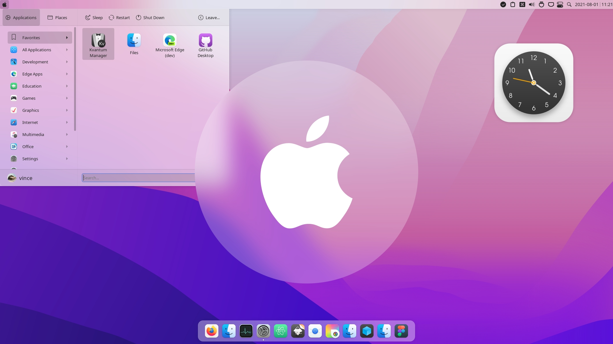
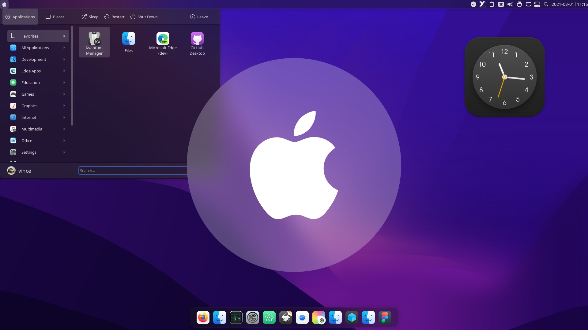

 
Ventura KDE Theme
======

Ventura kde is a MacOS Ventura like theme for KDE Plasma desktop.
based on Monterey-kde theme from vinceliuice
In this repository you'll find:

- Aurorae Theme
- Kvantum Theme
- Wallpaper Theme
- Plasma Color Scheme
- Plasma Desktop Theme
- Plasma Global Theme

## Installation

```sh
./install.sh
```

## Recommendations

- For better looking please use this pack with [Kvantum engine](https://github.com/tsujan/Kvantum/blob/master/Kvantum/INSTALL.md#distributions).

  Run `kvantummanager` to choose and apply **Ventura** (or any other Ventura) theme.
- Install [WhiteSur cursors theme](https://github.com/vinceliuice/WhiteSur-cursors) for a more consistent and beautiful experience.

## preview





